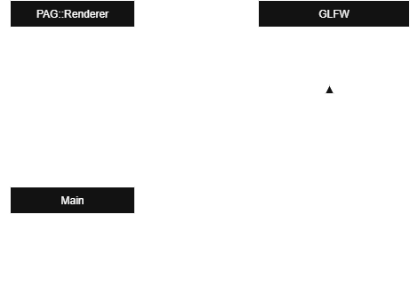
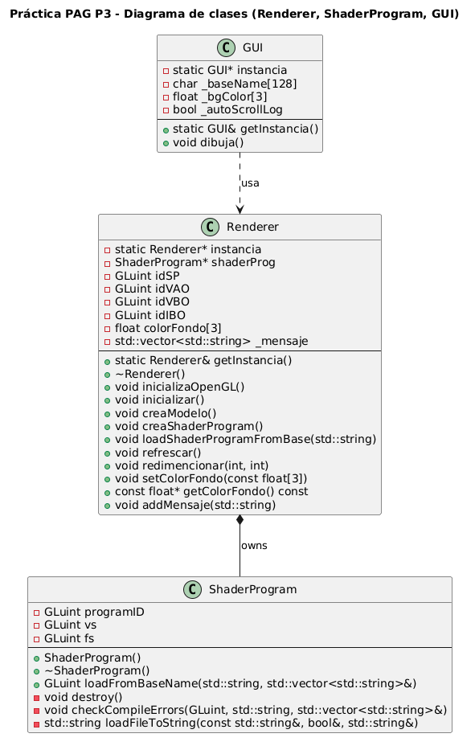
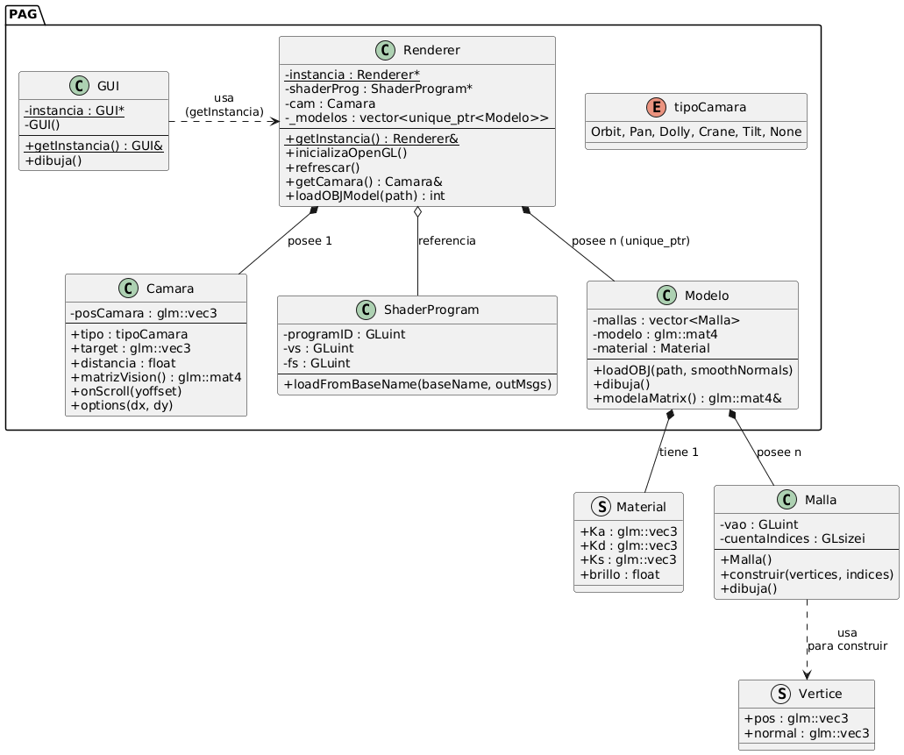
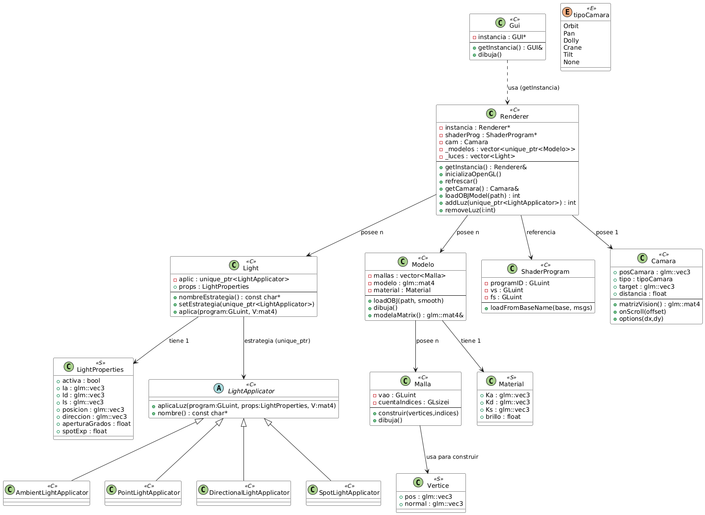

## Posible solución al problema planteado:

En esta práctica se plantea el problema de cómo encapsular la lógica de renderizado en una clase
(`PAG::Renderer`) y, al mismo tiempo, poder utilizar callbacks de GLFW.
La dificultad surge porque  GLFW exige que los callbacks sean **funciones globales** de estilo C, mientras que nosotros deseamos trabajar con **métodos de clase**.

Para encapsular el dibujado dentro de una clase, podemos crear la clase `PAG::Renderer`,  que contendrá el método `refrescaVentana()`.

### Propuesta de solución
1. Creamos el objeto `Renderer` en `main.cpp`.
2. Guardamos un puntero al objeto `Renderer` en la ventana GLFW mediante `glfwSetWindowUserPointer`.
3. Definimos un callback (`window_refresh_callback`) que recupera el puntero con `glfwGetWindowUserPointer`
   y llama a `renderer->refrescaVentana()`.

De este modo obtenemos un bajo acoplamiento:
-   Los callbacks de GLFW no dependen de la implementación interna de `Renderer`.
-   El callback es una función simple que solo conoce un puntero.
-   La clase `Renderer` se encarga de dibujar y refrescar la ventana.


### Diagrama UML




# Solución Practica 2

Partiendo de la practica anterior, procedemos a crear la clase Renderer, donde almacenaremos las llamadas a funciones OpenGL, para así desacoplar el código.

##  Cambios Realizados: 

### main.cpp
Solo mantendremos las llamadas a GLFW, mientras que las llamadas a OpenGL las realizaremos desde Renderer. 

```
glViewport(0, 0, anchoV, altoV);
glClearColor(color[0], color[1], color[2], 1.0f);
glClear(GL_COLOR_BUFFER_BIT | GL_DEPTH_BUFFER_BIT);
```
Estas operaciones, ahora las realizaremos desde Renderer::Refrescar() y Redimencionar(), quedando en nuestro main.cpp la llamada a Renderer.
```
PAG::Renderer::getInstancia().refrescar();
PAG::Renderer::getInstancia().redimencionar(ancho, alto);
```

### Callbacks
Procedemos a su vez a modificar aquellos callbacks que contaban con funciones de OpenGL.

-   **`window_refresh_callback`**: delega en `Renderer::getInstancia().refrescar()`.
    
-   **`framebuffer_size_callback`**: delega en `Renderer::getInstancia().redimencionar(width, height)`.
    
-   **`scroll_callback`**: ya no modifica un array de colores, sino que actualiza el color de fondo mediante `Renderer::setColorFondo(color)`.
    
-   **`mouse_button_callback`**: ahora comunica también los eventos de ratón a ImGui `io.AddMouseButtonEvent(button, true)`.


### Bucle principal
Ahora el bucle principal no mezclara OpenGl con la lógica de la interfaz.

```
 renderer.refrescar();      // Limpia la pantalla
 gui.dibuja();                          // Dibuja la interfaz gráfica
```

## ImGui
Finalmente podemos destacar la integracion del contexto ImGui en el main.cpp, de este modo, se delegan eventos de raton y del ciclo de eventos a ImGui. 

por ejemplo: 
```
void mouse_button_callback ( GLFWwindow *window, int button, int action, int mods ){  
    if ( action == GLFW_PRESS ){  
        ImGuiIO& io = ImGui::GetIO ();  
        io.AddMouseButtonEvent ( button, true );  
    }  
    else if ( action == GLFW_RELEASE ){  
        ImGuiIO& io = ImGui::GetIO ();  
        io.AddMouseButtonEvent ( button, false );  
    }  
  
}
```


### ¿Por qué el triángulo se deforma al redimensionar la ventana?

El triángulo se deforma al cambiar el tamaño de la ventana porque **no definimos
una proyección ni una matriz de transformación que mantenga la relación de aspecto**.

Actualmente, las coordenadas del triángulo se interpretan como `x` e `y` que va de `-1` a `1`.  
Al redimensionar la ventana, el *viewport* (`glViewport`) se ajusta al nuevo ancho y alto, pero OpenGL
simplemente estira esos valores para llenar todo el área de dibujo.

Esto provoca que si la ventana es más ancha que alta, el triángulo se **ensancha** y si la ventana es más alta que ancha, el triángulo se **aplasta en horizontal**.

La solución sería aplicar una **matriz de proyección** o bien ajustar
las coordenadas de dibujo en función del tamaño de la ventana.


# Proceso de Desacoplamiento:

En esta práctica se plantea desacoplar la gestion de shaders y permitir la carga de forma dinamica de los mismos, utilizando un nombre base introdcuido por el usuario.


## Solución Propuesta.
Mantenemos una estructura simple pero dividida:

-   `**Renderer**`: dueño del _shader program_ en uso, responsable del ciclo de render y de los recursos (VAO/VBO/IBO).

-   `**ShaderProgram**`: encapsula la lectura de ficheros GLSL, compilación de VS/FS y enlace del programa.

-   `**GUI**`: interfaz con ImGui para introducir el **nombre base** de los shaders y lanzar su carga; además muestra un **log** con los mensajes del sistema y un **selector de color** de fondo.


La carga de shaders se hace con un **patrón de reemplazo seguro** :

1.  `ShaderProgram` compila y linkea en **objetos temporales**.

2.  **Sólo si** todo sale bien, `Renderer` libera el programa anterior y **adopta** el nuevo.

3.  Si hay error, **no se toca** el programa actual (la app sigue dibujando)

## Cambios realizados.
-   **Clase** `**ShaderProgram**` (nueva)

   -   `GLuint loadFromBaseName(const std::string& baseName, std::vector<std::string>& msgs);`

   -   `void destroy();` (libera recursos GL del programa)

   -   `void checkCompileErrors(GLuint obj, const std::string& type, std::vector<std::string>& outMsgs);`

   -   `std::string loadFileToString(const std::string& filename, bool& ok, std::string& err);`


-   **Clase** `**Renderer**` (modificada)

   -   **Atributo**: `ShaderProgram* shaderProg` (miembro, no global)

   -   **Métodos**:

      -   `void creaShaderProgram();` (carga por defecto `pag03`)

      -   `void loadShaderProgramFromBase(const std::string& baseName);` (reemplazo seguro)

      -   `void creaModelo();` (VAO/VBO/IBO del triángulo)

      -   Guardas defensivas en `refrescar()` para no dibujar si `idSP/VAO/IBO == 0`.

-   **Clase** `**GUI**`

   -   **Atributos**: `char _baseName[128]` (buffer para `InputText`), `float _bgColor[3]`, `bool _autoScrollLog`

   -   **Métodos**: `void dibuja();` con:

      -   `ImGui::InputText("Base name##shader", _baseName, IM_ARRAYSIZE(_baseName))`

      -   Botón **Load** → `Renderer::loadShaderProgramFromBase(_baseName)`

      -   Ventana **Log** que muestra `Renderer::getMensaje()`


-   **Eliminación del puntero global**  `ShaderProgram* shaderProg` y uso exclusivo del **miembro** de `Renderer`.


-   Simplificación de `Renderer::~Renderer()` para liberar en orden: IBO/VBO/VAO y el `ShaderProgram`.


### Diagrama UML




# Práctica Cámara Virtual

## Descripción general

En esta práctica se ha implementado una cámara virtual interactiva en C++ utilizando **GLFW**, **OpenGL**, **GLM** e **ImGui**.  
La cámara permite distintos tipos de movimientos (Orbit, Pan, Tilt, Dolly, Crane, Zoom) que nos permiten ver la escena de forma controlada.

El sistema de cámara se ha integrado dentro del motor de renderizado (`Renderer`) de la aplicación, de manera que todos los cambios de vista afectan directamente a las matrices de **vista (`uView`)** y **proyección (`uProj`)** enviadas al *shader program* activo.

---

## Implementación de la cámara virtual

La clase `Camara` gestiona toda la lógica de movimiento, rotación y proyección.  
Está compuesta por los siguientes atributos principales:

- `posCamara`: posición actual de la cámara en el espacio.
- `target`: punto al que la cámara está mirando.
- `yawRad` / `pitchRad`: ángulos de rotación horizontal y vertical.
- `distancia`: distancia entre la cámara y el target.
- `campoVisY`: campo de visión vertical (para el zoom).
- `tipoCamara`: modo de control activo (`Orbit`, `Pan`, `Tilt`, `Dolly`, `Crane`, `None`).

La clase define dos métodos fundamentales que se utilizan desde el `Renderer`:
```cpp
glm::mat4 matrizVision() const;
glm::mat4 matrizProyeccion() const;
```

Ambos devuelven las matrices que se envían a los shaders para transformar la geometría en cada frame.

---
## Decisiones de diseño

- Integración en el Renderer: Mantenemos una única instancia de cámara dentro de Renderer, accesible mediante:
 
```cpp
Camara& Renderer::getCamara();
```

- Control de movimientos: Cada modo de cámara se implementó en el método:
```cpp
void Camara::options(float dx, float dy);
```

- Manejo con ratón:
    - Botón izquierdo: activa el movimiento según el modo de cámara seleccionado.
    - Rueda del ratón: controla el Zoom.
    - Movimiento del ratón: genera desplazamientos dx, dy.
  

- ImGui: En la GUI se añadió una ventana “Cámara” con un desplegable para seleccionar el tipo de movimiento.

---
## Instrucciones de uso
1. Ejecutar la aplicación.
2. En la ventana Shaders, cargar los ficheros pag05-vs.glsl y pag05-fs.glsl.
3. Abrir la ventana Cámara y seleccionar el tipo de movimiento:
   - Orbit: órbita alrededor del triángulo.

   - Pan: rotación horizontal.

   - Tilt: rotación vertical.

   - Dolly: acercar / alejar / moverse lateralmente.

   - Crane: subir / bajar.
4. Usar el ratón o los botones de GUI para mover la cámara.
5. Observar los cambios de vista sobre el modelo.


# Práctica 7 — Subrutinas GLSL y Materiales 

## Objetivo de la práctica

En esta práctica se amplía el motor gráfico desarrollado, incorporando:

- **Gestión de materiales por modelo** (Ka, Kd, Ks y shininess).
- **Visualización en modo sólido o alambre**, seleccionable desde la interfaz.
- **Uso de subrutinas GLSL** en el fragment shader para elegir dinámicamente cómo se genera el color final del fragmento.
- **Controles en ImGui** para modificar el material en tiempo real.
- Estructura interna actualizada del proyecto (**Modelos → Mallas**)

---

## Decisiones de diseño

### 1. Modelo compuesto por múltiples mallas
En lugar de mezclar todas las mallas del OBJ en un solo VAO/VBO, ahora cada modelo se compone de una lista de **Malla**, cada una con:

- VAO propio
- VBO propio
- IBO propio
- Su geometría independiente

Esto:

- Simplifica extensiones futuras (materiales, texturas, iluminación)
- Respeta la estructura que proporciona Assimp
- Evita mezclar diferentes sub-mallas en un único buffer

### 2. Material por modelo
Cada `Modelo` contiene ahora un objeto `Material`, con las propiedades:

```cpp
glm::vec3 Ka; // ambiente
glm::vec3 Kd; // difuso
glm::vec3 Ks; // especular
float brillo;
```

### 3. Subrutinas GLSL
En el fragment shader se define un tipo de subrutina:

subroutine vec4 fModoColor();

Y dos implementaciones:

- modoAlambre()

- modoSolido()

Dependiendo del checkbox en ImGui (“Wireframe”), se selecciona dinámicamente una u otra usando:

glUniformSubroutinesuiv(GL_FRAGMENT_SHADER, 1, &modoElegido);

### 4. Interfaz gráfica (ImGui)
Se añade una nueva sección “Material” con:

- Editores de color para Ka, Kd, Ks

- Slider para shininess

- Checkbox para activar el modo wireframe

---
## Funcionamiento del modo de visualización

Wireframe OFF
→ Subrutina activa: modoSolido()

Wireframe ON
→ Subrutina activa: modoAlambre()
→ Además OpenGL activa glPolygonMode(GL_LINE)

---
## UML Actual: 




# PRACTICA 8 – ILUMINACIÓN 

------------------------------------------------------------
## 2. FUNCIONALIDAD IMPLEMENTADA

### 2.1. Tipos de luz

Se han implementado cuatro tipos de luz:
- Luz ambiente
- Luz puntual
- Luz direccional
- Luz tipo foco 

Cada luz dispone de los parámetros típicos del modelo de Phong:

- Ia: componente ambiental (color ambiente de la luz).
- Id: componente difusa.
- Is: componente especular.
- Posición (para luz puntual y foco).
- Dirección (para luz direccional y foco).
- Apertura del foco (ángulo del cono).
- Exponente del foco (concentración del haz).

Todos estos parámetros se almacenan en la estructura LightProperties.


### 2.2. Renderizado multipasada

El renderer realiza el dibujo de la escena en varias pasadas:

- Si NO hay luces definidas:
    - Se dibuja la escena con una única iluminación ambiente por defecto para evitar que el modelo quede completamente negro.

- Si HAY luces definidas:
    - Se recorre el vector de luces.
    - Por cada luz activa:
        - Si es la primera luz:
            - Se limpia el color y el depth buffer.
            - Se establece un blending de tipo SRC_ALPHA, ONE_MINUS_SRC_ALPHA.
        - Para el resto de luces:
            - Se establece blending aditivo: SRC_ALPHA, ONE.
        - Se aplica la estrategia de esa luz (LightApplicator), que selecciona su subrutina GLSL y envía sus uniforms.
        - Se dibujan todos los modelos de la escena.
    - De este modo, la contribución de cada luz se acumula sobre la imagen.


### 2.3. Subrutinas GLSL

En el fragment shader se utilizan dos grupos de subrutinas:

- Subrutinas de iluminación (una por tipo de luz):
    - Luz ambiente.
    - Luz puntual.
    - Luz direccional.
    - Luz tipo foco.

- Subrutinas de modo de renderizado:
    - modoSolido: aplica la iluminación Phong.
    - modoAlambre: pinta el modelo en rojo para el modo wireframe.

------------------------------------------------------------
## 3. DISEÑO DE CLASES PRINCIPALES

### LightProperties

Clase (o estructura) que agrupa todos los parámetros de una luz.
Se utiliza para pasar información entre la GUI, las clases Light y LightApplicator y el shader.


### LightApplicator

Clase abstracta que define la interfaz común para todas las luces.

Cada implementación concreta se encarga de:
- Seleccionar la subrutina GLSL adecuada para su tipo de luz.
- Transformar posición y/o dirección al espacio de vista usando la matriz V.
- Enviar los uniforms correspondientes al shader.


### Clases derivadas de LightApplicator

- AmbientLightApplicator:
    - Aplica únicamente la componente ambiental de la luz.
    - No usa posición ni dirección.

- PointLightApplicator:
    - Transforma la posición de la luz a sistema de coordenadas de vista.
    - Aplica el modelo de Phong para luz puntual.

- DirectionalLightApplicator:
    - Transforma la dirección de la luz a coordenadas de vista.
    - Aplica iluminación direccional.

- SpotLightApplicator:
    - Transforma posición y dirección a coordenadas de vista.
    - Calcula el factor de foco en base a aperturaGrados y spotExp.
    - Aplica iluminación tipo foco.


### Light

- nombreEstrategia(): devuelve el nombre del tipo de luz, usado en la GUI.
- setEstrategia(): permite cambiar de tipo de luz manteniendo las propiedades.
- aplica(GLuint program, const glm::mat4& V): llama a la estrategia actual para aplicar la luz en el shader.

Esto permite que desde la interfaz se pueda cambiar el tipo de luz (por ejemplo, de puntual a foco) sin perder los valores de color, posición, etc.


### Renderer

El Renderer es el encargado de:

- Gestionar el shader program actual (pag08-vs.glsl / pag08-fs.glsl).
- Guardar y actualizar las matrices de vista y proyección (Camera).
- Gestionar la lista de modelos (carga de OBJ, selección, borrado, materiales).
- Gestionar la lista de luces (añadir, eliminar, aplicar).
- Ejecutar el bucle de dibujo (refrescar) utilizando el sistema multipasada.

Puntos clave:
- fetchUniforms(): busca las localizaciones de uModel, uView, uProj y otros uniforms.
- fetchSubroutines(): obtiene los índices de las subrutinas modoSolido y modoAlambre en el fragment shader.
- dibujaModelos(): recorre todos los modelos, envía su matriz de modelado, su material y selecciona la subrutina de modo (alambre o sólido).
- refrescar(): realiza el proceso completo de dibujo utilizando las luces definidas.


------------------------------------------------------------
## 4. SHADERS UTILIZADOS (pag08)

Shader de vértices (pag08-vs.glsl):

- Recibe atributos de posición y normal.
- Calcula la posición en coordenadas de mundo y/o vista.
- Calcula las normales transformadas de forma correcta (usando la matriz normal).
- Envía al fragment shader la posición y la normal necesarias para el cálculo de la iluminación.

Shader de fragmentos (pag08-fs.glsl):

- Declara los uniforms de material (uKa, uKd, uKs, uShininess).
- Declara los uniforms de luz según el tipo (posiciones, direcciones, colores).
- Declara subrutinas para los distintos tipos de luz (ambiente, puntual, direccional, foco).
- Declara subrutinas para el modo de dibujo (modoSolido, modoAlambre).
- En función de la subrutina seleccionada desde C++, calcula el color final del fragmento.
- En modo sólido se aplica el modelo de Phong combinado con la contribución de la luz actual.
- En modo alambre se muestra el modelo en un color fijo (por ejemplo, rojo).

## Diagrama UML.





# Práctica 9 – Texturas

## Integración de Texturas

### Carga de texturas con LodePNG

Se implementó la clase `Textura`, encargada de:

1. Cargar el PNG mediante `lodepng::decode`.
2. Voltear la imagen verticalmente.
3. Crear la textura OpenGL usando:
    - `glTexImage2D`
    - `glTexParameteri` 
    - `glGenerateMipmap()`

Código relevante:

```cpp
unsigned error = lodepng::decode(_imagen, _ancho, _alto, fichero);
if (error) throw std::runtime_error("No se pudo cargar la textura");

glTexImage2D(GL_TEXTURE_2D, 0, GL_RGBA, _ancho, _alto, 0,
             GL_RGBA, GL_UNSIGNED_BYTE, _imagen.data());
glGenerateMipmap(GL_TEXTURE_2D);

```
Se maneja el fallo de textura sin abortar la carga del modelo.

### Incorporación de coordenadas UV a los modelos

Los UV se obtienen desde Assimp:

```cpp
if(mesh->HasTextureCoords(0))
v.texCoord = {
mesh->mTextureCoords[0][i].x,
mesh->mTextureCoords[0][i].y
};
else
v.texCoord = {0.f, 0.f};
```

En Malla::construir() se añadieron al VAO:

```cpp
glVertexAttribPointer(2, 2, GL_FLOAT, GL_FALSE, sizeof(Vertice),
(void*)offsetof(Vertice, texCoord));
glEnableVertexAttribArray(2);
```

Ahora cada vértice almacena:

- posición
- normal
- coordenada de textura

### Activación y uso de la textura en la aplicación

Cada Modelo posee una textura opcional:
```cpp
unique_ptr<Textura> _textura;
bool _usarTextura;
```

Las texturas se activan así:
```cpp
m->getTextura().activar(0);
```

La selección del modo texturizado se gestiona mediante subrutinas GLSL.

### Subrutinas en GLSL para Color y Luz

En el fragment shader (pag09-fs.glsl) se definieron dos subrutinas:

Subrutina de COLOR
```cpp
subroutine vec4 MetodoColor();
subroutine uniform MetodoColor uMetodoColor;

subroutine (MetodoColor)
vec4 ColorMaterial() { ... }

subroutine (MetodoColor)
vec4 ColorTextura() {
return texture(muestreador, v_TexCoord);
}
```
Subrutina de LUZ
```cpp
subroutine vec4 MetodoLuz(vec4 baseColor);
subroutine uniform MetodoLuz uMetodoLuz;

subroutine (MetodoLuz) vec4 LuzAmbiente(vec4 c) { ... }
subroutine (MetodoLuz) vec4 LuzPuntual(vec4 c)  { ... }
subroutine (MetodoLuz) vec4 LuzDireccional(vec4 c) { ... }
subroutine (MetodoLuz) vec4 LuzSpot(vec4 c) { ... }
```

En Renderer::fetchSubroutines() se obtienen sus índices:
```cpp
idxColorMaterial = glGetSubroutineIndex(idSP, GL_FRAGMENT_SHADER, "ColorMaterial");
idxColorTextura  = glGetSubroutineIndex(idSP, GL_FRAGMENT_SHADER, "ColorTextura");
idxLuzAmbiente   = glGetSubroutineIndex(idSP, GL_FRAGMENT_SHADER, "LuzAmbiente");
...
```

Durante el dibujado se elige:
```cpp
if (m->usaTextura())
config[locMetodoColor] = idxColorTextura;
else
config[locMetodoColor] = idxColorMaterial;

config[locMetodoLuz] = idxLuzActual;

glUniformSubroutinesuiv(GL_FRAGMENT_SHADER, _numSubrutinasActivas, config.data());
```

### Cambios en la interfaz

Se añadieron controles:

- Activar/desactivar modo texturizado.
- Cargar shaders.
- Añadir tipos de luces.
- Mostrar errores de carga en el log.

## Diagrama UML.


# Practica 10: Normal Mapping y Sombras. 

## Descripción 
En esta práctica se ha aumentado el realismo de la escena implementando dos técnicas avanzadas:
1.  **Normal Mapping**: Simulación de relieve en superficies planas mediante la perturbación de las normales usando una textura especial (mapa de normales).
2.  **Shadow Mapping**: Generación de sombras proyectadas dinámicas mediante el algoritmo de dos pasadas (Shadow Pass + Render Pass).

---

## 1. Normal Mapping

### Cambios en  (`Modelo` y `Malla`)
Para que el Normal Mapping funcione, necesitamos trabajar en el **Espacio Tangente**.
1.  **Carga de Tangentes y Bitangentes**:
    En `Modelo::loadOBJ`, se añadió el flag `aiProcess_CalcTangentSpace`.
2.  **Atributos de Vértice**:
    La estructura `Vertice` y la clase `Malla` ahora gestionan dos nuevos atributos:
    ```cpp
    struct Vertice {
        // ... pos, normal, texCoord ...
        glm::vec3 tangente;
        glm::vec3 bitangente;
    };
    ```
    En `Malla::construir`, se habilitaron los atributos en las localizaciones 3 y 4 del VAO.

3.  **Gestión de Texturas**:
    Se modificó `Renderer::dibujaModelos` para gestionar multitextura:
    * **Unidad 0**: Textura de Color (Difusa).
    * **Unidad 1**: Mapa de Normales (`_mapaNormal`).
    * Se envía un uniform booleano `uUsarNormalMap` para activar/desactivar el efecto desde GUI.

### Cambios en Shaders (Espacio Tangente)
* **Vertex Shader (`pag10-vs.glsl`)**: Calcula la **Matriz TBN Inversa** para transformar los vectores de luz y visión del espacio de vista al espacio tangente.
    ```glsl
    mat3 normalMatrix = transpose(inverse(mat3(matrizMV)));
    vec3 T = normalize(normalMatrix * tangente);
    vec3 B = normalize(normalMatrix * bitangente);
    vec3 N = normalize(normalMatrix * normal);
    salida.vTBNinv = transpose(mat3(T, B, N));
    ```
* **Fragment Shader (`pag10-fs.glsl`)**: Si el efecto está activo, decodifica la normal de la textura `[0,1]` al rango `[-1,1]`.
    ```glsl
    vec3 normalMapa = texture(muestreadorNormal, entrada.vTexCoord).rgb;
    N = normalize(normalMapa * 2.0 - 1.0);
    ```

---

## 2. Sombras Proyectadas (Shadow Mapping)

Se implementó un algoritmo de **dos pasadas** para generar sombras dinámicas para luces Direccionales y Focos.

### Pasada 1: Generación del Mapa de Sombras
Se creó un FBO (`_fboSombras`) con una textura de profundidad adjunta (`_texSombra`).
En `Renderer::refrescar()`:
1.  Se configura el viewport al tamaño del mapa de sombras (1024x1024).
2.  Se activa el FBO de sombras.
3.  Se activa **`glCullFace(GL_FRONT)`** para solucionar el problema de sombras desconectadas.
4.  Se renderiza la escena desde el punto de vista de la luz usando un Shader simplificado (`_idSPSombras`) que solo calcula la posición.

### Pasada 2: Renderizado de la Escena
1.  Se vuelve al FBO por defecto (0) y al viewport de la ventana.
2.  Se calcula la **Matriz de Sombras** que transforma coordenadas de mundo a espacio de textura de la luz:
    ```cpp
    glm::mat4 matSombrasUniform = B * lightSpaceMatrix; 
    ```
3.  Se activa la textura de sombras en la **Unidad 2**.

### Cambios en Shaders
* **Sampler de Sombra**: Se usa `sampler2DShadow` en el fragment shader.
* **Proyección**: La función `textureProj` realiza la comparación de profundidad automáticamente para determinar si un fragmento está en sombra o luz.
    ```glsl
    float s = textureProj(muestreadorSombra, entrada.vCoordenadasSombra);
    return vec4(PhongTangente(N, L_tg, V, colorBase.rgb, s, atenuacion), 1.0);
    ```

---
